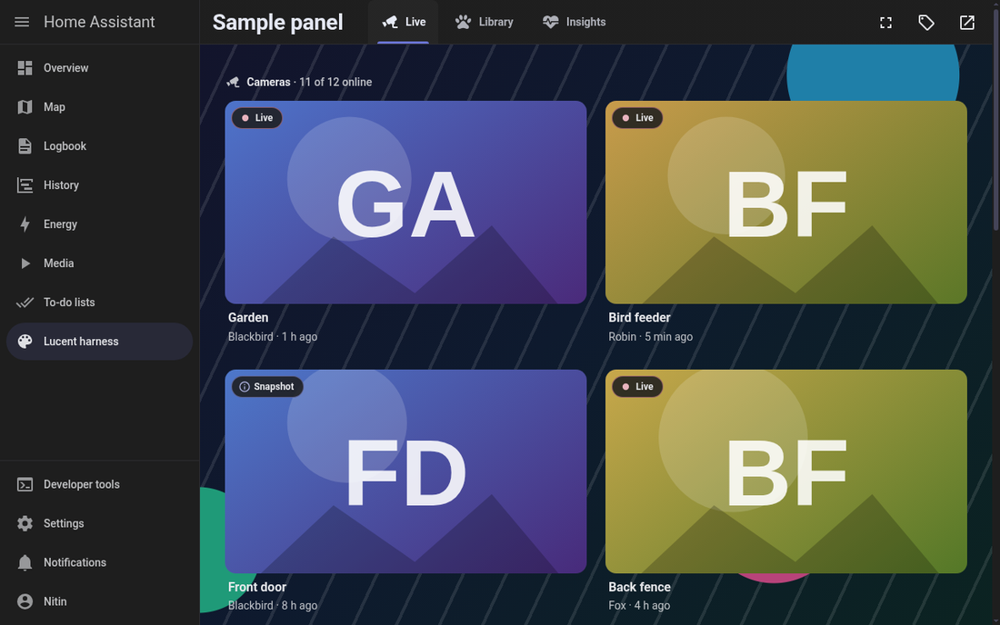
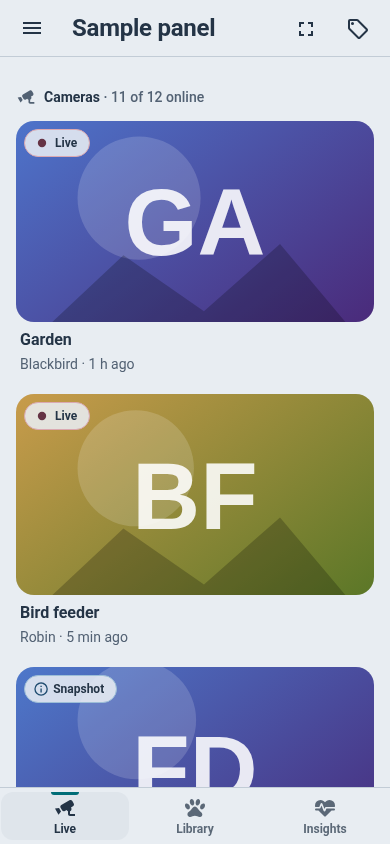
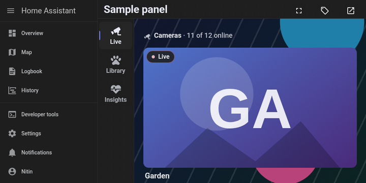
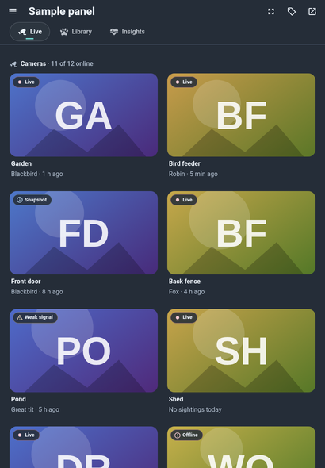

# lucent-ha

**One shared set of building blocks for custom Home Assistant panels and cards, in the Lucent design language.**
Written in Lit 3 + TypeScript. It makes a custom panel feel like part of Home Assistant itself: Home Assistant's menu button is always
one tap away, Back closes a sheet before it leaves the page, scroll is remembered, the colours follow the Home Assistant theme live
(flat and glass), and everything works from a phone to a 2560 px monitor and the 960x480 Echo Show wall display.

Kestrel (cameras and wildlife) is the first app built on it. Other apps adopt it one at a time.

<!-- screenshots: docs/images, made by `dev/screenshots.mjs` (see "Pictures" below) -->


| Phone, flat light | Echo Show 960x480, glass dark | Tablet, flat dark |
|---|---|---|
|  |  |  |

## In plain words

- You do **not** copy buttons, sheets, toasts and navigation from app to app any more. They live here, once, and an app picks the ones it needs.
- The toolkit never has its own colours. It reads Home Assistant's theme variables, so Neumorphism, Liquid Glass, Frosted Glass or the default theme all
  look right, and switching theme changes everything at once without a reload.
- Each app gives the toolkit its **own prefix** (Kestrel uses `kestrel`), so its elements are called `<kestrel-lu-sheet>`, `<kestrel-lu-button>` and so on.
  Two apps on the same page can each carry their own copy of the toolkit and never collide, and the old bare `lu-*` names (iLedClock owns them) are never used.

## Quick start

```sh
npm install lit github:nphil/lucent-ha#v0.1.0
```

The package ships plain ES modules plus type declarations (`dist/`), so your own esbuild bundles it (and drops what you do not use). Lit is a peer dependency.

```ts
// main.ts: register the toolkit under your app's name
import { defineLucent } from "lucent-ha";
const lu = defineLucent({ prefix: "kestrel" });   // <kestrel-lu-app-shell>, <kestrel-lu-sheet>, <kestrel-lu-button> ...
```

A panel in 25 lines (the app shell supplies the colours/sizes for everything inside it, a sticky bar with Home Assistant's menu button and your tabs):

```ts
import { LitElement, html } from "lit";
import { navigate } from "lucent-ha";

const DESTINATIONS = [
  { id: "live", label: "Live", icon: "mdi:cctv", href: "/kestrel/live" },
  { id: "wildlife", label: "Wildlife", icon: "mdi:bird", href: "/kestrel/wildlife", badge: 3 },
  { id: "checkup", label: "Check-up", icon: "mdi:heart-pulse", href: "/kestrel/checkup" },
];

class KestrelPanel extends LitElement {
  static properties = { hass: { attribute: false }, narrow: { type: Boolean }, route: { attribute: false } };
  render() {
    const view = this.route.path.split("/")[1] || "live";
    return html`
      <kestrel-lu-app-shell .hass=${this.hass} ?narrow=${this.narrow} heading="Kestrel" nav-label="Camera sections"
          .destinations=${DESTINATIONS} current=${view} @lu-navigate=${(event) => navigate(this, event.detail.href)}>
        <kestrel-lu-view-stack current=${view}>
          <section data-view="live">Live goes here</section>
          <section data-view="wildlife">Wildlife goes here</section>
        </kestrel-lu-view-stack>
      </kestrel-lu-app-shell>`;
  }
}
customElements.define("kestrel-panel", KestrelPanel);
```

Home Assistant gives a custom panel `hass`, `narrow` and `route`; you pass them on. More examples: [`docs/api/*.md`](docs/api) (one page per area) and the sample app in [`docs/scenario-panel.md`](docs/scenario-panel.md).

### Lean bundles (tree-shaking)

`defineLucent` registers every element. A card that only needs a button and a chip registers just those, plus whatever they render, and the bundle contains only that code:

```ts
import { LuButton, LuChip, defineElements } from "lucent-ha";
const lu = defineElements("aquarium", [LuButton, LuChip]);   // <aquarium-lu-button>, <aquarium-lu-chip>
```

Measured with esbuild (minified, Lit included): the whole toolkit is about 52 KB gzipped, a lean consumer with just a button and a chip about 13 KB (`scripts/consumer-test.mjs` prints both).

Every area is also importable on its own: `lucent-ha/ha`, `/tokens`, `/shell`, `/view`, `/sheet`, `/grid`, `/state`, `/image`, `/audio`, `/components`, `/core`.

## What is inside

| Area | What it gives you | Docs |
|---|---|---|
| **Tokens and device profiles** | One Lucent v2 token layer (`TOKENS_CSS`) that reads only Home Assistant variables; profiles phone / tablet / desktop / smart (Echo Show) from the panel width, the screen height and the pointer type; shell sizes, z-index bands, safe areas | [tokens](#screen-sizes-and-profiles) |
| **HA integration** `lucent-ha/ha` | The menu-button rule Home Assistant itself uses, `hass-toggle-menu`, wall mode (`hass-kiosk-mode`), `navigate` / `goBack`, **history layers** (the system Back closes the top layer first), tab history, reconnect grace (10 s), device settings | [ha](docs/api/ha.md) |
| **App shell and navigation** | Sticky HA-style app bar; destinations as tabs (>= 900 px), pills (680-899), bottom bar (< 680) or left rail (height <= 500); keyboard shortcuts; wall mode; toast host | [shell](docs/api/shell.md) |
| **View stack** | Keep-alive pages, exact scroll memory, a module-level stale-while-revalidate cache (`swr`) so a re-created panel paints from memory, stale-chunk reload guard | [view](docs/api/view.md) |
| **Sheet and toast** | One sheet for panels and cards (Home Assistant's own adaptive dialog when it exists, a native top-layer dialog otherwise), swipe down, Back/Escape/scrim/button, no soft keyboard on touch, side pane on wide screens; toast with Undo | [sheet](docs/api/sheet.md) |
| **Grid, states, section, row** | Container-driven grids with per-kind tile sizes, static skeletons, empty / error / stale states, titled sections, rows | [content](docs/api/content.md) |
| **Images and audio** | Aspect-box images with one shared observer and sized URLs, thumbnail rail with an "N and a half" peek, inline audio player (one recording at a time) and list | [media](docs/api/media.md) |
| **Controls** | Button, chip / badge (incl. evidence badges), segmented, stepper, slider, hold-to-confirm with a tap fallback | [controls](docs/api/controls.md) |
| **Dev harness** | A copy of Home Assistant's frame (sidebar, drawer, panel area, four real themes, nine screen sizes), a specimen of every element, screenshot and perf tools | [harness](docs/harness.md), [perf](docs/perf.md) |

## How it fits into Home Assistant

- A native custom panel is appended into Home Assistant's `ha-panel-custom`, which draws **no header** for it and lets the **page** scroll. The app shell therefore draws an HA-style sticky bar (`--app-header-*` colours) and never touches `html`/`body`.
- The hamburger appears exactly when Home Assistant's own would (`narrow`, or the sidebar set to "always hidden"; not in kiosk mode, not when the Companion app has its own sidebar) and fires `hass-toggle-menu`.
- Every modal layer (sheet, picker, focused camera) is one history entry, so Back closes the top layer first and then leaves the page. Tabs never grow the Back stack. Cards never push history.
- Opt-in **wall mode** for the Echo Show switches Home Assistant to kiosk mode (no sidebar), and the bar shows its own menu button.
- Colours: only Home Assistant variables (`--primary-color`, `--primary-text-color`, `--ha-card-*`, `--app-header-*`, `--divider-color` ...). Overlays use HA's dialog surface; text over photos and video uses a near-opaque reading surface (glass themes make cards translucent).
- Press feedback is a wash (and a veil over pictures), never a scale: a transform on press costs a compositor layer and 6-13 ms of main-thread work per press.

## Screen sizes and profiles

The profile comes from the **panel's own width** (not the window: Home Assistant's sidebar takes 56-256 px), the **screen height** and how the screen is operated (`hover`/`pointer`), never from the user agent.

| Container width | Destinations | Profile |
|---|---|---|
| < 680 px | bottom bar (measured into `--lu-bottom-bar`) | phone (< 600), tablet |
| 680-899 px | a row of pills under the bar | tablet |
| >= 900 px | tabs inside the bar | tablet (touch) / desktop |
| screen height <= 500 px, any width | left rail, 48 px bar | phone (sideways) or **smart** (touch, 960x480 class: 64 px targets, larger type) |

Content is capped at 1600 px (grids) and 1100 px (text); tiles never exceed 560 px; tile minimums are camera 360, species 176, visit 280. A threshold is crossed by 20 px before the layout switches back, so a scrollbar cannot make it flicker.

## Panels and cards

The same elements work in a Lovelace card. Differences: sheets and toasts always use the browser's top layer (glass themes trap `position: fixed` inside `ha-card`), `history` is switched off (`history="false"` on the sheet), `lu-root mode="card"` reads the container width only and listens to nothing global, and work is gated by an `IntersectionObserver`.

## Develop and verify

```sh
npm install --include=dev
npm test                                   # unit tests (node --test, no browser)
node dev/serve.mjs                         # the harness on http://127.0.0.1:4180/harness.html
node dev/build.mjs                         # rebuild it (about a second)
node dev/shot.mjs --theme all --device phone,smart --only button --out /tmp/x-{theme}-{device}.png
node dev/screenshots.mjs                   # the whole picture set: 4 themes x 9 sizes
node dev/perf-check.mjs                    # budget gate (see docs/perf.md; needs a quiet host)
node scripts/consumer-test.mjs             # installs the package like an app would, type-checks, bundles, loads two prefixes on one page
node scripts/ha-check.mjs                  # reality check against a real Home Assistant (see the script header)
```

Browser tools use the shared Chromium (CDP `127.0.0.1:43977`). On this host run them through `scripts/lu-run` / `scripts/lu-browser` (serialised, nice'd, memory-capped).

### Pictures

`dev/screenshots.mjs` writes every element and the sample app at all nine sizes in all four themes. The full set is attached to each GitHub Release (`lucent-ha-specimens-vX.Y.Z.zip`); `docs/images/` holds the few used above.

### Budgets

Press feedback <= 50 ms; cached tab switch first paint <= 100 ms and stable <= 300 ms (<= 2x at 4x CPU); sheet open <= 220 ms; Back closes the top layer <= 100 ms; no long task > 50 ms while scrolling; layout shift <= 0.02. `dev/perf-check.mjs` measures them (real touch/mouse input, 1x and 4x CPU, press cost as thread time from a trace so it does not depend on host load). **v0.1.0 ships the tool, not final numbers:** the first runs happened on a busy host (load 24-37) and are marked PROVISIONAL; the quiet-window run is scheduled (see [`docs/perf.md`](docs/perf.md)). Layout shift measured 0 in every view-stack and shell run; the real-Home-Assistant check (`scripts/ha-check.mjs`) passes.

## Using it from Kestrel

[`docs/migration-kestrel.md`](docs/migration-kestrel.md) lists exactly which Kestrel pieces map to which toolkit parts, what stays in Kestrel, the gaps, and a safe order of steps.

## Versions and releases

Semver; every release is a tag `vX.Y.Z` with GitHub Release notes and `CHANGELOG.md`. Apps pin the tag (`"lucent-ha": "github:nphil/lucent-ha#v0.1.0"`). One prefix means one toolkit version per page: give every app its own prefix. `dist/` is committed so a git install needs no build step; `npm run build` regenerates it.

## Licences

MIT (`LICENSE`). Eleven source files derived from Music Assistant's frontend (Apache-2.0) keep a header and are listed in [`THIRD_PARTY_NOTICES.md`](THIRD_PARTY_NOTICES.md), with the licence in `LICENSES/Apache-2.0.txt`.
